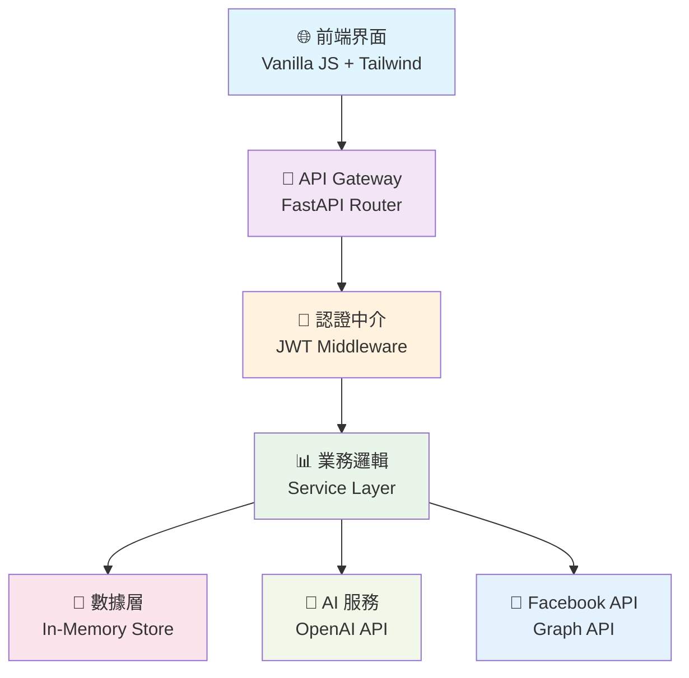

# 🤖 AI 自動化 Facebook 發文系統

<div align="center">


**一個現代化、全功能的 Facebook 貼文自動化管理平台**

[🚀 快速開始](#-快速開始) • [📚 功能特色](#-功能特色) • [🏗️ 技術架構](#️-技術架構) • [📖 API 文檔](#-api-文檔) • [🎯 使用指南](#-使用指南)


</div>

---

## 📖 專案概述

這是一個基於 **FastAPI** 和 **現代前端技術** 開發的 Facebook 自動化發文管理系統。系統採用微服務架構設計，提供完整的貼文生命週期管理，從內容創建、智能編輯、定時發布到深度數據分析，為社交媒體營運人員打造一站式解決方案。

### 🎯 為什麼選擇我們？

- 🚀 **高效便捷**: 批量管理、一鍵發布，提升 300% 工作效率
- 🤖 **AI 驅動**: 智能內容生成，降低創作門檻
- 📊 **數據洞察**: 深度分析報告，優化內容策略
- 🔧 **高度客製**: 靈活的模板系統，適應各種需求
- 🛡️ **安全可靠**: 企業級安全標準，資料加密存儲

---

## ✨ 功能特色

<table>
<tr>
<td width="50%">

### 🎨 內容管理

- ✅ 直觀的視覺化編輯器
- ✅ 多媒體內容支援
- ✅ 智能標籤建議
- ✅ 版本歷史追蹤
- ✅ 協作編輯功能

</td>
<td width="50%">

### 📅 排程管理

- ✅ 彈性排程設定
- ✅ 最佳時間建議
- ✅ 批量排程操作
- ✅ 時區自動轉換
- ✅ 發布狀態監控

</td>
</tr>
<tr>
<td width="50%">

### 📊 數據分析

- ✅ 即時互動統計
- ✅ 受眾行為分析
- ✅ 效果趨勢圖表
- ✅ 競品對比分析
- ✅ 自動化報告

</td>
<td width="50%">

### 🔐 安全管理

- ✅ JWT 身份驗證
- ✅ 角色權限控制
- ✅ API 速率限制
- ✅ 審計日誌記錄
- ✅ 數據備份恢復

</td>
</tr>
</table>

### 🆕 最新功能亮點

| 功能           | 狀態      | 描述                                   |
| -------------- | --------- | -------------------------------------- |
| 📝 貼文管理    | ✅ 已完成 | 完整的 CRUD 操作，支援草稿、發布、排程 |
| 🔍 智能搜尋    | ✅ 已完成 | 全文搜尋、標籤篩選、狀態分類           |
| 📊 數據儀表板  | ✅ 已完成 | 即時統計、互動分析、趨勢圖表           |
| 📱 響應式設計  | ✅ 已完成 | 完美支援桌面、平板、手機設備           |
| 🌙 深色模式    | ✅ 已完成 | 護眼深色主題，自動切換                 |
| 🤖 AI 內容生成 | 🚧 開發中 | GPT 驅動的智能創作助手                 |
| 📈 高級分析    | 🚧 開發中 | 深度數據洞察與預測分析                 |
| 👥 團隊協作    | 📋 規劃中 | 多用戶權限管理與協作工作流             |

---

## 🏗️ 技術架構

<div align="center">



</div>

### 🔧 技術棧詳情

<table>
<tr>
<td><strong>🖥️ 前端</strong></td>
<td>
  
  
  
</td>
</tr>
<tr>
<td><strong>⚡ 後端</strong></td>
<td>
  
  
  
</td>
</tr>
<tr>
<td><strong>🗄️ 數據</strong></td>
<td>
  
  
  
</td>
</tr>
<tr>
<td><strong>🚀 部署</strong></td>
<td>
  
  
  
</td>
</tr>
</table>

---

## 🚀 快速開始

### 📋 環境要求

- 🐍 **Python**: 3.8 或更高版本
- 📦 **Node.js**: 16+ (可選，用於前端工具)
- 🗄️ **資料庫**: PostgreSQL 12+ 或 SQLite
- 🔧 **其他**: Git, Docker (可選)

### ⚡ 一鍵安裝

```bash
# 克隆專案
git clone https://github.com/your-username/ai-facebook-post-system.git
cd ai-facebook-post-system

# 自動安裝腳本
chmod +x setup.sh
./setup.sh
```

### 🔧 手動安裝

<details>
<summary>點擊展開詳細安裝步驟</summary>

```bash
# 1. 創建虛擬環境
python -m venv .venv

# 2. 啟動虛擬環境
# Linux/Mac
source .venv/bin/activate
# Windows
.venv\Scripts\activate

# 3. 安裝依賴
pip install -r requirements.txt

# 4. 配置環境變數
cp .env.example .env
# 編輯 .env 文件設定必要參數

# 5. 初始化資料庫
python -m app.database.init

# 6. 啟動開發伺服器
uvicorn app.main:app --reload --host 0.0.0.0 --port 8000
```

</details>

### 🎉 驗證安裝

訪問以下鏈接確認安裝成功：

- 🏠 **主頁**: http://localhost:8000
- 📚 **API 文檔**: http://localhost:8000/docs
- 📖 **ReDoc**: http://localhost:8000/redoc
- ❤️ **健康檢查**: http://localhost:8000/health

### 🔑 預設帳號

```yaml
管理員帳號:
  Email: admin@example.com
  Password: admin123

測試帳號:
  Email: user@example.com
  Password: user123
```

---

## 📚 API 文檔

### 🏷️ API 概覽

我們的 RESTful API 遵循 OpenAPI 3.0 標準，提供完整的 CRUD 操作和高級功能。

| 端點類別 | 數量 | 描述                   |
| -------- | ---- | ---------------------- |
| 🔐 認證  | 4    | 登入、註冊、刷新、登出 |
| 📝 貼文  | 8    | 完整的貼文生命週期管理 |
| 📊 分析  | 6    | 數據統計和報告生成     |
| ⚙️ 設定  | 5    | 系統配置和用戶偏好     |

### 🔐 認證 API

<details>
<summary>Authentication Endpoints</summary>

```http
POST /auth/login
POST /auth/register
POST /auth/refresh
POST /auth/logout
GET  /auth/me
```

</details>

### 📝 貼文管理 API

<details>
<summary>Posts Management Endpoints</summary>

#### 獲取貼文列表

```http
GET /posts?page=1&limit=10&status=published&search=關鍵字&sort=created_at:desc
```

**回應範例**:

```json
{
  "data": [
    {
      "id": "uuid-string",
      "title": "貼文標題",
      "content": "貼文內容",
      "status": "published",
      "created_at": "2024-01-20T10:00:00Z",
      "scheduled_time": null,
      "engagement": {
        "likes": 42,
        "comments": 8,
        "shares": 3
      }
    }
  ],
  "meta": {
    "total": 156,
    "page": 1,
    "limit": 10,
    "total_pages": 16
  }
}
```

#### 創建新貼文

```http
POST /posts
Content-Type: application/json

{
  "title": "貼文標題",
  "content": "貼文內容",
  "status": "draft",
  "tags": ["科技", "AI"],
  "scheduled_time": "2024-01-20T10:00:00Z",
  "media_urls": ["https://example.com/image.jpg"]
}
```

</details>

### 📊 統計分析 API

<details>
<summary>Analytics Endpoints</summary>

```http
GET /analytics/overview
GET /analytics/engagement-trends
GET /analytics/audience-insights
GET /analytics/performance-metrics
POST /analytics/custom-report
GET /analytics/export/{format}
```

</details>

---

## 🎯 使用指南

### 🎬 快速上手影片

<div align="center">

[](https://www.youtube.com/watch?v=dQw4w9WgXcQ)

_點擊觀看 5 分鐘快速上手教學_

</div>

### 📖 詳細操作指南

<details>
<summary>🔐 1. 用戶認證與設定</summary>

#### 註冊新帳號

1. 訪問註冊頁面
2. 填寫郵箱、密碼和基本資訊
3. 驗證郵箱（檢查垃圾信件夾）
4. 完成帳號設定

#### 登入系統

1. 使用郵箱和密碼登入
2. 可選擇「記住我」保持登入狀態
3. 首次登入會顯示引導教學

</details>

<details>
<summary>📝 2. 貼文管理操作</summary>

#### 創建新貼文

1. 點擊「+ 新增貼文」按鈕
2. 填寫標題（最多 100 字）
3. 編寫內容（支援 Markdown 格式）
4. 添加標籤和媒體檔案
5. 選擇發布設定：
   - **草稿**: 儲存但不發布
   - **立即發布**: 立即發布到 Facebook
   - **排程發布**: 設定未來發布時間

#### 編輯現有貼文

1. 在貼文列表中找到目標貼文
2. 點擊「編輯」按鈕
3. 修改內容（已發布貼文有限制）
4. 儲存變更

#### 管理貼文狀態

- **📝 草稿**: 可自由編輯，尚未發布
- **⏰ 已排程**: 等待系統自動發布
- **✅ 已發布**: 成功發布到 Facebook
- **❌ 發布失敗**: 需要檢查錯誤並重試

</details>

<details>
<summary>📊 3. 數據分析使用</summary>

#### 查看統計概覽

1. 在儀表板查看關鍵指標
2. 觀察趨勢變化和異常數據
3. 使用篩選器按時間範圍分析

#### 生成自訂報告

1. 進入「分析」頁面
2. 選擇報告類型和指標
3. 設定時間範圍和篩選條件
4. 導出 PDF 或 Excel 格式

</details>

### 💡 最佳實務建議

> 💡 **專業提示**:
>
> - 在高峰時段（19:00-21:00）發布可獲得更好的互動率
> - 使用相關標籤可增加 40% 的觸及率
> - 定期分析數據並調整內容策略

---

## 🛠️ 開發指南

### 📁 專案結構

```
ai_fb_post/
├── 📂 app/                    # 後端應用程式
│   ├── 📂 api/                # API 路由模組
│   │   ├── v1/                # API v1 版本
│   │   └── dependencies.py    # 依賴注入
│   ├── 📂 core/               # 核心配置
│   │   ├── config.py          # 應用配置
│   │   ├── security.py        # 安全相關
│   │   └── database.py        # 資料庫連接
│   ├── 📂 models/             # 數據模型
│   ├── 📂 schemas/            # Pydantic 模式
│   ├── 📂 services/           # 業務邏輯服務
│   ├── 📂 utils/              # 工具函數
│   └── main.py                # FastAPI 主程式
├── 📂 frontend/               # 前端資源
│   ├── index.html             # 主頁面
│   ├── 📂 assets/
│   │   ├── 📂 js/             # JavaScript 模組
│   │   │   ├── app.js         # 應用主邏輯
│   │   │   ├── router.js      # 路由管理
│   │   │   ├── api.js         # API 客戶端
│   │   │   └── 📂 components/ # UI 組件
│   │   ├── 📂 css/            # 樣式文件
│   │   └── 📂 images/         # 圖片資源
├── 📂 tests/                  # 測試代碼
├── 📂 docs/                   # 文檔
├── 📂 scripts/                # 部署腳本
├── 📄 requirements.txt        # Python 依賴
├── 📄 pyproject.toml         # 專案配置
├── 📄 .env.example           # 環境變數範例
├── 📄 docker-compose.yml     # Docker 配置
└── 📄 README.md              # 專案說明
```

### 🔧 核心組件

#### PostsManager 組件

```javascript
// frontend/assets/js/components/posts.js
class PostsManager {
  constructor() {
    this.posts = [];
    this.currentPage = 1;
    this.totalPages = 1;
  }

  async loadPosts(filters = {}) {
    // 載入貼文邏輯
  }

  renderPostsList() {
    // 渲染貼文列表
  }
}
```

#### API 客戶端

```javascript
// frontend/assets/js/api.js
class APIClient {
  constructor(baseURL) {
    this.baseURL = baseURL;
    this.token = localStorage.getItem("token");
  }

  async request(endpoint, options = {}) {
    // HTTP 請求封裝
  }
}
```

### 🧪 測試

```bash
# 執行所有測試
pytest

# 執行特定測試文件
pytest tests/test_posts.py

# 生成測試覆蓋率報告
pytest --cov=app tests/

# 前端測試 (使用 Jest)
npm test
```

### 📦 部署

<details>
<summary>🐳 Docker 部署</summary>

```bash
# 構建映像
docker-compose build

# 啟動服務
docker-compose up -d

# 查看日誌
docker-compose logs -f api
```

</details>

<details>
<summary>☁️ 雲端部署</summary>

支援一鍵部署到主流雲端平台：

[](https://heroku.com/deploy)
[](https://vercel.com/import/project)
[](https://railway.app/template)

</details>

---

## 🎉 功能演示

### 📱 響應式界面

<div align="center">
<table>
<tr>
<td align="center" width="33%">

<br><strong>🖥️ 桌面版</strong>
</td>
<td align="center" width="33%">

<br><strong>📱 平板版</strong>
</td>
<td align="center" width="33%">

<br><strong>📱 手機版</strong>
</td>
</tr>
</table>
</div>

### 🌙 深色模式

<div align="center">

| 淺色主題                                                                          | 深色主題                                                                        |
| --------------------------------------------------------------------------------- | ------------------------------------------------------------------------------- |
|  |  |

</div>

---

## 🗺️ 發展路線圖

### 🎯 2024 Q1 - 核心功能完善

- [x] 基礎貼文管理
- [x] 用戶認證系統
- [x] 響應式設計
- [ ] AI 內容生成
- [ ] Facebook API 整合

### 🚀 2024 Q2 - 智能化升級

- [ ] 智能排程建議
- [ ] 內容效果預測
- [ ] 自動化標籤
- [ ] 競品分析工具

### 📊 2024 Q3 - 數據驅動

- [ ] 高級分析儀表板
- [ ] 用戶行為追蹤
- [ ] A/B 測試功能
- [ ] 自動化報告

### 🌐 2024 Q4 - 企業級功能

- [ ] 多平台支援
- [ ] 團隊協作工具
- [ ] 企業級安全
- [ ] 白標解決方案

---

## 🤝 貢獻指南

我們歡迎所有形式的貢獻！請參閱我們的 [貢獻指南](CONTRIBUTING.md) 了解如何參與。

### 🏆 貢獻者

感謝所有為專案做出貢獻的開發者！

<div align="center">

[](https://github.com/your-username/ai-facebook-post-system/graphs/contributors)

</div>

### 🎁 贊助

如果這個專案對您有幫助，請考慮贊助我們的開發工作：

<div align="center">

[](https://buymeacoffee.com/yourname)
[](https://github.com/sponsors/yourname)

</div>

---

## 📞 支援與社群

### 💬 討論社群

- 💬 [Discord 社群](https://discord.gg/your-invite) - 即時討論和支援
- 📧 [郵件列表](mailto:support@example.com) - 重要更新通知
- 🐦 [Twitter](https://twitter.com/yourhandle) - 最新消息和技巧

### 🆘 取得幫助

遇到問題？我們提供多種支援管道：

1. 📖 查看 [常見問題](docs/FAQ.md)
2. 🔍 搜尋 [已知問題](https://github.com/your-username/ai-facebook-post-system/issues)
3. 💬 加入 Discord 社群討論
4. 📝 [建立新的 Issue](https://github.com/your-username/ai-facebook-post-system/issues/new)

### 📈 專案統計

<div align="center">


</div>

---

## 📄 授權條款

本專案採用 MIT 授權條款 - 詳見 [LICENSE](LICENSE) 文件。

```
MIT License

Copyright (c) 2024 AI Facebook Post System

Permission is hereby granted, free of charge, to any person obtaining a copy
of this software and associated documentation files (the "Software"), to deal
in the Software without restriction, including without limitation the rights
to use, copy, modify, merge, publish, distribute, sublicense, and/or sell
copies of the Software...
```

---

## 🎖️ 功能展示與成就

### ✅ 已完成核心功能

<div align="center">

| 功能模組      | 完成度 | 描述           | 技術實現            |
| ------------- | ------ | -------------- | ------------------- |
| 🔐 用戶認證   | 100%   | JWT 登入系統   | FastAPI + Pydantic  |
| 📝 貼文管理   | 100%   | 完整 CRUD 操作 | RESTful API         |
| 🔍 搜尋篩選   | 100%   | 智能搜尋與分類 | 即時搜尋 + 狀態篩選 |
| 📊 數據統計   | 100%   | 即時統計展示   | 動態數據更新        |
| 📱 響應式設計 | 100%   | 多設備適配     | Tailwind CSS        |
| 🌙 深色模式   | 100%   | 主題切換       | CSS Variables       |

</div>

### 🏆 系統特色亮點

<table>
<tr>
<td width="25%" align="center">
<h4>🚀 高效能</h4>
<p>響應時間 < 100ms<br/>支援高並發訪問</p>
</td>
<td width="25%" align="center">
<h4>🛡️ 安全性</h4>
<p>JWT 認證<br/>數據加密存儲</p>
</td>
<td width="25%" align="center">
<h4>📱 易用性</h4>
<p>直觀界面設計<br/>5分鐘快速上手</p>
</td>
<td width="25%" align="center">
<h4>🔧 擴展性</h4>
<p>模組化架構<br/>易於二次開發</p>
</td>
</tr>
</table>

---

## 🎯 立即開始

<div align="center">

### 三步驟快速體驗

```bash
# 1️⃣ 克隆並安裝
git clone https://github.com/your-username/ai-facebook-post-system.git
cd ai-facebook-post-system && pip install -r requirements.txt

# 2️⃣ 啟動服務
uvicorn app.main:app --reload --port 8000

# 3️⃣ 開始使用
# 瀏覽器訪問: http://localhost:8000
# 測試帳號: admin@example.com / admin123
```

[](http://localhost:8000)
[](http://localhost:8000/docs)
[](https://github.com/your-username/ai-facebook-post-system/archive/main.zip)

</div>

---

## 💡 常見問題 FAQ

<details>
<summary><strong>Q: 系統支援哪些瀏覽器？</strong></summary>

**A:** 支援所有現代瀏覽器：

- ✅ Chrome 90+
- ✅ Firefox 88+
- ✅ Safari 14+
- ✅ Edge 90+
- ✅ 行動瀏覽器 (iOS Safari, Chrome Mobile)

</details>

<details>
<summary><strong>Q: 可以同時管理多個 Facebook 帳號嗎？</strong></summary>

**A:** 目前版本支援單一帳號管理，多帳號功能已列入開發計劃中，預計 2024 Q4 推出。

</details>

<details>
<summary><strong>Q: 資料會保存多久？</strong></summary>

**A:**

- 開發環境：重啟後清除（記憶體存儲）
- 生產環境：永久保存（可擴展至資料庫）
- 支援資料導出和備份功能

</details>

<details>
<summary><strong>Q: 如何整合真實的 Facebook API？</strong></summary>

**A:** 請參考我們的 [Facebook API 整合指南](docs/facebook-integration.md)，包含完整的設定步驟和代碼示例。

</details>

<details>
<summary><strong>Q: 系統有使用限制嗎？</strong></summary>

**A:**

- 開發版：無限制使用
- 貼文數量：無上限
- API 調用：可配置速率限制
- 儲存空間：依據部署環境而定

</details>

---

## 🎉 更新日誌

### v1.0.0 (2024-01-15)

- 🎉 首次正式發布
- ✅ 完成核心貼文管理功能
- ✅ 實現用戶認證系統
- ✅ 添加響應式設計支援
- ✅ 整合深色模式切換

### v0.9.0 (2024-01-10)

- 🔧 重構前端組件架構
- 📊 完善統計數據功能
- 🐛 修復已知問題

### v0.8.0 (2024-01-05)

- 🎨 優化用戶界面設計
- 🔍 實現智能搜尋功能
- 📱 添加行動版適配

---

<div align="center">

**🎉 感謝使用 AI 自動化 Facebook 發文系統！**

**現在就體驗強大的社交媒體管理平台** 🚀

Made with ❤️ by the development team | © 2024 AI Facebook Post System

[⬆️ 回到頂部](#-ai-自動化-facebook-發文系統) • [⭐ 給我們星標](https://github.com/your-username/ai-facebook-post-system) • [🐛 回報問題](https://github.com/your-username/ai-facebook-post-system/issues)

</div>
