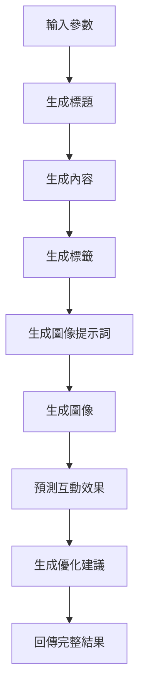

# AI 自動化 Facebook 發文系統 - 使用指南

## 🚀 功能概覽

這個系統整合了最新的 AI 技術，提供以下強大功能：

### 🤖 AI 貼文生成

- **智能內容創作**：使用 LangGraph 工作流程生成高轉化率貼文
- **多元主題支援**：支援推廣、教育、娛樂等多種貼文類型
- **受眾分析**：針對不同目標受眾優化內容
- **語調調整**：提供友善、專業、幽默等多種語調選擇

### 🖼️ AI 配圖生成

- **自動配圖**：使用 DALL-E 3 生成與內容相關的高質量圖片
- **風格多樣**：支援現代簡約、卡通插畫、攝影風格等多種視覺風格
- **智能匹配**：AI 自動分析貼文內容生成最適合的配圖

### 📊 效果預測與優化

- **互動預測**：AI 分析預測貼文的按讚、留言、分享等互動效果
- **優化建議**：提供具體的改進建議提升貼文表現
- **數據追蹤**：完整記錄 AI 生成的元數據供後續分析

## 🛠️ 安裝與設定

### 1. 安裝依賴套件

```bash
# 安裝基礎套件
pip install -r requirements.txt
```

### 2. 配置 AI 服務

#### OpenAI API 設定

1. 前往 [OpenAI Platform](https://platform.openai.com/) 註冊帳號
2. 創建 API Key
3. 在應用程式的「AI 設定」標籤頁輸入 API Key

#### Anthropic API 設定（可選）

1. 前往 [Anthropic Console](https://console.anthropic.com/) 註冊帳號
2. 創建 API Key
3. 在應用程式的「AI 設定」標籤頁輸入 API Key

### 3. 啟動應用程式

```bash
streamlit run streamlit_app.py
```

## 📖 使用教學

### 🤖 AI 智能生成貼文

1. **選擇 AI 生成標籤頁**
2. **填寫貼文參數**：
   - **貼文主題**：描述要推廣的內容（必填）
   - **目標受眾**：選擇主要受眾群體
   - **貼文類型**：選擇貼文目的（推廣、教育等）
   - **語調風格**：選擇適合的語調
3. **設定生成選項**：
   - 勾選「包含標籤」自動生成 hashtags
   - 勾選「生成配圖」創建 AI 圖片
4. **點擊「AI 生成貼文」**
5. **預覽結果**：查看 AI 生成的內容、效果預測和優化建議
6. **保存或重新生成**：滿意後保存，或重新生成新版本

### ✍️ 手動創建貼文

1. **選擇手動創建標籤頁**
2. **輸入標題和內容**
3. **上傳配圖**（可選）：支援 PNG、JPG、JPEG、GIF 格式
4. **選擇發布狀態**：草稿或排程發布
5. **點擊創建貼文**

### ⚙️ AI 設定管理

1. **API 金鑰設定**：

   - OpenAI API Key（用於 GPT 和 DALL-E）
   - Anthropic API Key（用於 Claude，可選）

2. **模型設定**：

   - 選擇語言模型（GPT-4o-mini、GPT-4o、Claude-3 等）
   - 選擇圖像生成模型（DALL-E 3、DALL-E 2）

3. **生成參數調整**：
   - **創意度**：控制 AI 的創造性（0.0-1.0）
   - **最大生成長度**：設定生成內容的最大字數
   - **啟用圖像生成**：開關圖像生成功能

## 🎯 AI 生成流程

系統使用 LangGraph 構建的多步驟工作流程：



### 各步驟說明：

1. **標題生成**：根據主題和受眾生成吸引人的標題
2. **內容創作**：使用心理學原理和 storytelling 技巧創作內容
3. **標籤優化**：生成相關且有效的 hashtags
4. **配圖設計**：生成詳細的圖像描述並創作配圖
5. **效果預測**：分析預期的互動表現
6. **優化建議**：提供具體的改進方向

## 💡 最佳實踐

### 主題設定技巧

- **具體明確**：「新款智慧手錶發布」比「新產品」更好
- **包含情境**：「聖誕節限時優惠」、「夏日防曬知識」
- **考慮受眾**：針對不同年齡層使用不同的主題描述

### 受眾選擇指南

- **年輕族群**：使用流行用語、表情符號、趨勢話題
- **專業人士**：強調價值、效率、專業見解
- **家庭主婦**：關注實用性、家庭生活、省錢技巧

### 配圖生成建議

- **選擇合適風格**：商品推廣用攝影風格，教育內容用插畫
- **避免文字**：AI 生成的圖片中文字可能不清楚
- **考慮平台特性**：Facebook 偏好明亮、正向的視覺內容

## 🔧 進階功能

### 批量生成

可以為同一主題生成多個版本進行 A/B 測試：

1. 使用不同語調風格
2. 嘗試不同貼文類型
3. 比較有無配圖的效果

### 效果分析

系統會記錄每篇 AI 生成貼文的詳細資訊：

- 生成時間和使用的模型
- 預測的互動分數
- 優化建議
- 是否包含配圖

### 自定義優化

根據過往表現調整生成參數：

- 提高創意度探索新風格
- 調整字數限制適應受眾喜好
- 選擇表現最佳的模型組合

## 🚨 注意事項

### API 使用限制

- OpenAI 有每分鐘請求數限制
- DALL-E 圖像生成需要額外費用
- 建議先用較便宜的模型測試

### 內容審核

- AI 生成的內容需要人工審核
- 確保符合 Facebook 社群準則
- 檢查是否有敏感或不當內容

### 隱私安全

- API 金鑰僅存儲在本地
- 不會傳送個人敏感資訊
- 建議定期更換 API 金鑰

## 📞 技術支援

如遇到問題，請檢查：

1. **網路連線**：確保能正常連接 AI 服務
2. **API 金鑰**：檢查是否正確設定且有效
3. **帳戶額度**：確認 API 帳戶有足夠額度
4. **錯誤訊息**：查看應用程式顯示的具體錯誤

## 🔮 未來功能

計劃中的功能：

- 🎯 更多 AI 模型選擇
- 📅 智能發布時間建議
- 📈 自動效果追蹤
- 🔄 A/B 測試自動化
- 🌐 多語言內容生成

---

享受 AI 驅動的智能發文體驗！🚀
